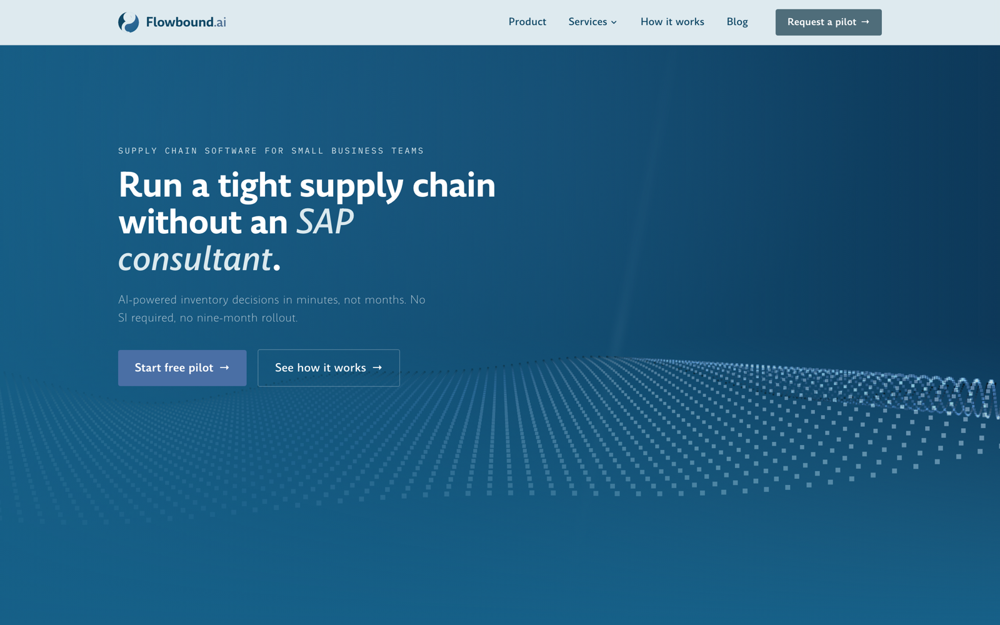

# Flowbound.ai

**Marketing site for Flowbound, an AI supply chain product for small business teams**, positioned as
the fast alternative to an SAP implementation. Live at
[www.flowbound.ai](https://www.flowbound.ai).

[](https://astro.build)
[](https://www.typescriptlang.org)
[](https://tailwindcss.com)
[](https://threejs.org)
[](https://www.flowbound.ai)



## What this is

A static, server-render-free marketing site (Astro, `output: "static"`) covering a homepage, a
product page, seven dedicated capability pages, three narrative service pages, a fully filterable
blog (21 posts across 8 categories), and supporting pages, 86 routes total. Built and maintained
solo, end to end: architecture, visual design system, copywriting, SEO, and production deploys.

No backend, no CMS, no JS framework runtime shipped by default. The interesting engineering is
in what that constraint forces: hand-rolled canvas/WebGL animation, a real content pipeline for
SEO copy, and a verification process that substitutes for a test suite on a project that has none.

## Engineering highlights

**Zero-JS-by-default, with two deliberately scoped exceptions, each verified, not assumed.**
The site ships no JavaScript framework runtime on any page. Two pages (the homepage and
`/product`) run a real WebGL particle system via three.js. That dependency is a 515KB chunk, and
after every build I grep the built `dist/*.html` output to confirm it is referenced by exactly
those two pages and no others, rather than trusting that a lazy import stayed scoped. Every other
page's animated hero is hand-written Canvas 2D: 12 distinct compositions (bar charts, radar
sweeps, racing lanes, a conveyor belt, comet-trail pulses), each modeling something specific to
that page's content, not one template recolored twelve times.

**A real, diagnosed SEO bug, not a hypothetical one.** Google Search Console flagged
"Alternate page with proper canonical tag" across the blog. Root cause turned out to be two
independent mismatches: the site's canonical config pointed at the domain that 308-redirects away
from itself instead of the one that actually serves traffic, and canonical URLs were missing the
trailing slash the app's own routing requires. Fixed both, then wrote a repeatable check: after
any build, script a comparison between every canonical tag in `dist/**/index.html` and the
generated sitemap, and `curl` every internal `href` against the preview server to confirm it
resolves, so the same class of bug can't ship silently again.

**A verification process that substitutes for a test suite.** There is no test suite by design,
this is a marketing site, not an app with business logic worth unit-testing. Instead: `astro
check` for types, `astro build` for a clean static build, and a real headless-browser (Playwright)
screenshot pass against the production build before any UI change is called done, including
explicitly emulating `reducedMotion: 'no-preference'` to catch a real class of bug this dev
machine's OS-level accessibility setting was silently masking (default screenshots always showed
the static fallback frame, never the live animation).

**A repeatable SEO content pipeline, not ad hoc blog posts.** All 21 posts were rewritten through
a defined process: competitor-article research against actual top-ranking pages (not vendor
homepages), a content-gap analysis, a featured-snippet-targeted outline, a draft in a consistent
voice, an EEAT self-review, and internal links woven into real sentences rather than dropped in as
a bare list. It's the standing default for new posts now, not a one-time cleanup.

**Data-driven where it matters, hand-authored where it doesn't.** `src/data/services.ts` is the
single source of truth for the services nav dropdown, the `/services` page content, and that
page's JSON-LD schema simultaneously, so adding a capability there is enough to appear correctly
in all three. Pages that are genuinely one-off (the homepage, `/product`, `/how-it-works`) stay as
plain authored components instead of being forced into a data schema they don't need.

## AI-assisted engineering workflow

This project is built with [Claude Code](https://claude.com/claude-code) as a primary development
tool, and that's intentional to document rather than gloss over. [`CLAUDE.md`](CLAUDE.md) in this
repo is the actual working spec: every architectural decision, every real bug found and its root
cause (not just "fixed"), and every explicit constraint, updated after each session and read at
the start of the next. It is long because the project is real, not because it was padded.

The workflow underneath it is closer to running a rigorous code review than "vibe coding": a
constraint is stated once and expected to hold (no em dashes anywhere in the codebase, square-ish
corners as the default border radius, contrast checked against real WCAG math rather than eyeballed),
UI changes are verified against a running browser instead of trusted from a green build, and
mistakes are recorded with their root cause so the same class of bug does not recur. A few are
documented in `CLAUDE.md` in detail: an `IntersectionObserver` that silently never fires because
`clip-path` was applied directly to the observed element, and a set of SVG icon glyphs where two
strokes met at an exact shared coordinate and compounded into a visible dark artifact only at
certain render sizes, caught by sampling pixel color numerically rather than eyeballing a
screenshot.

## Tech stack

| | |
|---|---|
| Framework | [Astro](https://astro.build) 7, static output, zero client-side JS framework runtime by default |
| Language | TypeScript, strict mode |
| Styling | Tailwind CSS 3, a custom two-palette design system (see `tailwind.config.js`) |
| 3D / WebGL | [three.js](https://threejs.org), scoped to 2 of 86 pages (see highlights above) |
| Animation | Hand-written Canvas 2D (12 bespoke hero compositions), `IntersectionObserver`-driven scroll reveals, vanilla TS, no animation library |
| Content | Astro Content Layer API, Markdown blog posts, schema-validated via `src/content.config.ts` |
| Fonts | Satoshi, IBM Plex Mono, Amulya, all self-hosted `.woff2`, no third-party font CDN |
| Linting | [oxlint](https://oxc.rs) |
| Type checking | `@astrojs/check` |
| Deployment | Vercel, auto-deploy on push to `main` |

## Run locally

```bash
npm install
npm run dev
```

Open the local URL Astro prints (defaults to `http://localhost:4321`).

## Build, lint, and verify

```bash
npm run build     # `astro check` (type check) then `astro build`
npm run preview   # serve the production build locally
npm run lint      # oxlint
```

There's no test suite. For any UI change, `astro check` and `astro build` passing isn't enough on
its own: verify it visually with a real headless-browser screenshot against `npm run preview`
before calling it done (see "Engineering highlights" above for why).

## Deployment

Live at [www.flowbound.ai](https://www.flowbound.ai) (the bare apex `flowbound.ai` 308-redirects
to it), hosted on Vercel, connected to this GitHub repo. Every push to `main` auto-deploys. No
environment variables are required.

## Pages

86 built routes. The core set:

| Route | File | Notes |
|---|---|---|
| `/` | `src/pages/index.astro` | Homepage, WebGL hero |
| `/product` | `src/pages/product.astro` | Product deep dive, WebGL hero |
| `/how-it-works` | `src/pages/how-it-works.astro` | Scroll-driven Canvas 2D hero, tied to actual scroll position, not a timer |
| `/services` | `src/pages/services.astro` | Services overview, content driven by `src/data/services.ts` |
| `/ask-flowbound`, `/customer-service`, `/quality-monitoring` | `src/pages/*.astro` | Whole-service narrative pages |
| `/demand-forecasting`, `/inventory-tracking`, `/shipping-optimization`, `/supplier-coordination`, `/wholesale-account-management`, `/reorder`, `/pricing` | `src/pages/*.astro` | Dedicated capability pages, shared five-section template |
| `/blog` | `src/pages/blog/[...page].astro` | Paginated index, sitewide search/filter, see Blog below |
| `/blog/[slug]` | `src/pages/blog/[slug].astro` | Individual post |
| `/blog/tags/[tag]` | `src/pages/blog/tags/[tag].astro` | Posts filtered by tag |
| `/rss.xml` | `src/pages/rss.xml.ts` | RSS feed of all posts |
| `/404` | `src/pages/404.astro` | Not found page |

`src/data/services.ts` is the single source of truth for `/services`: the nav dropdown and the
page's JSON-LD both derive from it, so adding a service there is enough for it to show up in both.
A capability, or a whole service, can set `href`/`ctaLabel` there to get a dedicated page wired up
automatically.

## Blog

- Posts are Markdown files in `src/content/blog/`, schema in `src/content.config.ts`. Each post
  needs a `category` (one of a fixed list in `src/data/blogCategories.ts`) and any number of
  freeform `tags`.
- `/blog` shows 9 posts per page with a search box and per-category checkboxes. Every post on the
  site is rendered into every page's HTML (hidden if not on that particular page), so search and
  category filters match across the whole blog, not just the current page. See
  `src/scripts/blogFilter.ts`.
- Card thumbnails (`src/components/BlogThumbnail.astro`) are generated from the post's category
  icon rather than real images, no photography to source or maintain as posts get added.

## Project structure

```
src/
├── pages/            One file per route (86 built routes)
├── layouts/           BaseLayout.astro: shared shell (nav, footer, font preloads, Seo)
├── components/        Nav, Footer, logo, homepage sections, one animated hero
│                       background component per secondary page
├── data/               services.ts (drives /services + nav + JSON-LD), nav.ts, blogCategories.ts
├── content/blog/       Markdown posts, Content Layer API
├── scripts/             Vanilla TS: 12 Canvas 2D hero animations, scroll-reveal system,
│                       shared hover/tilt effects, blog filter logic
└── lib/                 Small shared helpers (tag slugs, etc.)
public/fonts/           Self-hosted Satoshi, IBM Plex Mono, Amulya
```

See [`CLAUDE.md`](CLAUDE.md) for the full architectural log (every page, component, and script,
why it exists, and every real bug found along the way) and
[`BRAND_GUIDELINES.md`](BRAND_GUIDELINES.md) for the visual and copy system.

## Known placeholders

- Customer Service and Quality Monitoring copy is a reasonable extrapolation from Flowbound's
  existing positioning, not confirmed product capabilities yet.
- The pilot request buttons in the closing CTA open a plain `mailto:` link. A real form or CRM
  integration is the next step for actually capturing leads.

## License

Proprietary. All rights reserved. Source is public for portfolio purposes; not licensed for reuse.
